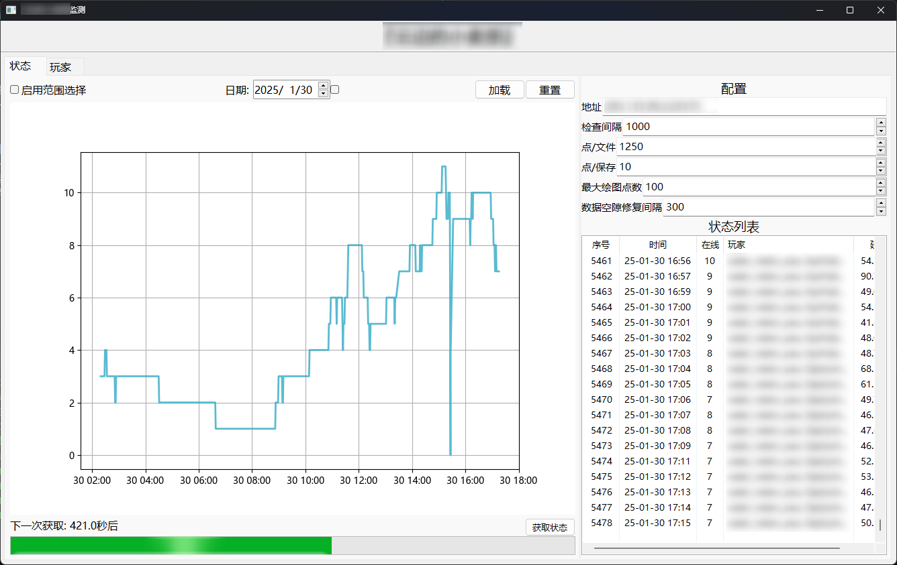
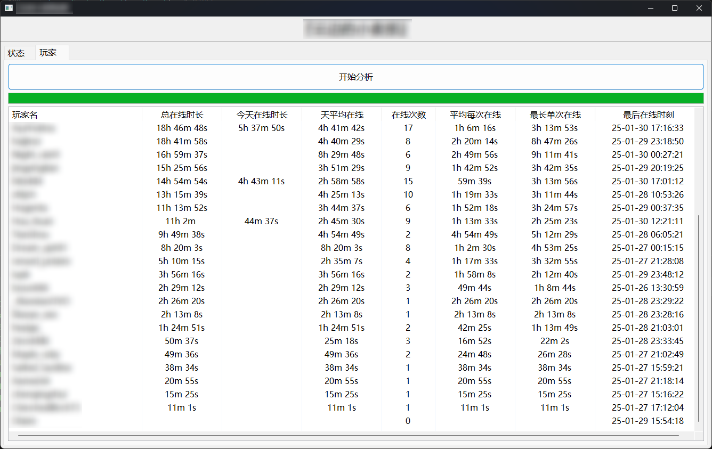

# *CloudStatus*
### 一个以实用为主的服务器玩家监视工具
没啥美术细胞

---
### 我们提供
1. 可选日期的玩家数量图表
2. 服务器玩家在线时间分析
### 如何使用
1. 下载项目压缩包
2. 解压至某地并在终端中打开
3. `pip install -r requirements.txt` 安装对应运行库
4. `python main.py`运行项目
5. 项目运行后可在GUI界面配置服务器地址
### 运行环境
1. Python 3.10.9
### 画廊

#### 软件主界面 

#### 玩家分析 