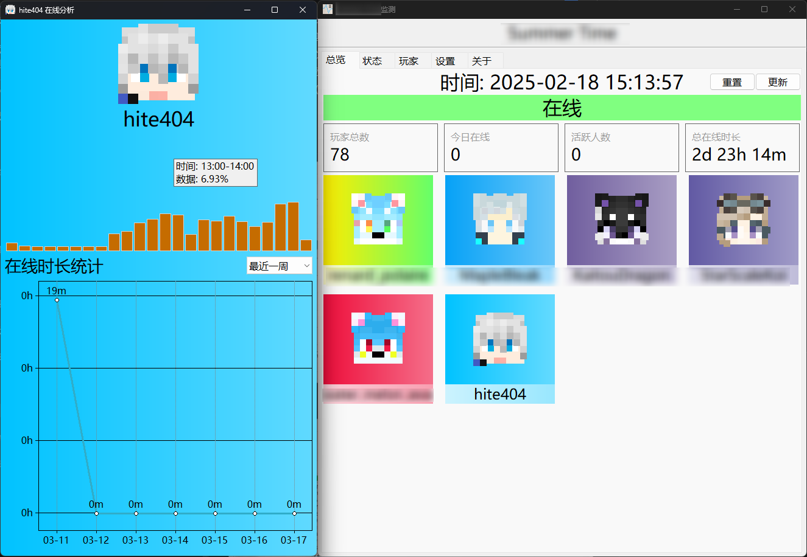
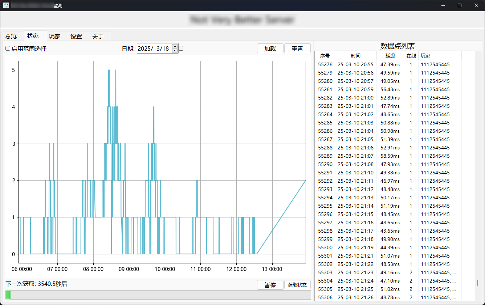
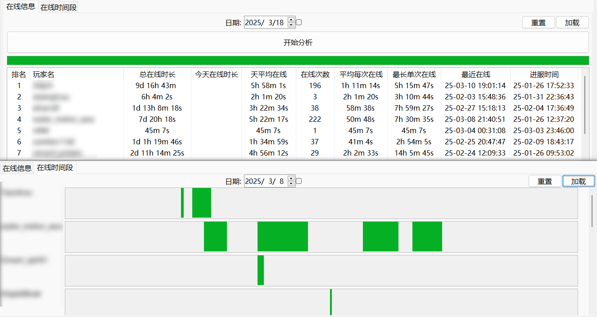

#  *CloudStatus*

> 一个服务器监测工具, 支持玩家在线分析
> 
> ~~没啥美术细胞, 不美观~~ **以实用为主**

---

~~暂时不会为此软件提供任何许可证，软件代码仅供学习~~

好耶，我们有MPL许可证！

---

### 项目特点
1. 可选日期的 _**玩家数量图表**_
2. 可选日期的 _**玩家在线时长分析 数据+图表**_
3. 支持重复获取状态以 _**获取全部玩家**_ (应对玩家量不多但每次只会返回随机12个玩家的服务器)
4. 小巧的数据体积, 数据量: _**213KB/day**_ (日均10玩家) (玩家映射表格式)

### 如何使用
_**版本较旧**_: 到 Release 下载打包好的zip压缩包直接运行

_**版本最新**_ (介于我不写测试, bug可能会有几只)🪳🕷️🐛:
1. `git clone https://github.com/hite4044/CloudStatus.git` 克隆项目 or 下载项目源码压缩包
2. `cd CloudStatus` 在终端中定位到项目目录
3. `pip install -r requirements.txt` 安装项目运行库
4. `python main.py` 运行项目
5. 项目运行后可在GUI界面进行配置

### 注意事项
1. 如果遇到无法检测服务器信息的情况, 请尝试把配置项`记录服务器延迟`关闭 (新版本已修复)
2. 如果发现数据点显示的人数与玩家的数量不一致, 请尝试打开折叠配置项里的 `启用获取全部玩家`
3. 其实你可以把鼠标放在配置项的标签上面查看 `说明文本`

### 项目相关
1. Python 3.10.9
2. [项目导航图](readme_assets/project.md)

### 计划的功能
🤓☝️诶！我有一个好点子

- [ ] 界面上部添加服务器的状态预览 (像MC里那样)
- [ ] 数据定时备份功能
- [ ] 数据点列表 - 查找玩家功能
- [ ] 在线人数图表
  - [ ] 数据去重
  - [ ] 数据重采样 (平滑)
  - [x] 右键跳转至对应数据点
- [ ] 添加紧急保存数据功能
- [ ] 可选玩家卡片颜色选取头像主色
- [ ] 玩家分析数据可导出为Excel文件
- [x] 配置组可折叠展开
- [x] 玩家在线分析窗口
  - [x] 增加在线分析时间图表
  - [x] 增加最近在线时间段列表
- [x] 赶紧给我优化菜单！
- [x] 优化眼睛取色算法
- [x] 玩家面板双击项可以打开游玩分析窗口
- [x] 自定义皮肤加载地址支持
- [x] 关于页改进
- [x] 玩家分析面板 - 分析列表添加玩家头像
- [x] 是否记录ping延迟 配置项
- [x] 多次获取状态以获取全部玩家 支持&配置项
- [x] 新的数据格式 (将每个玩家全部放进另一个字典, 原映射表又指向多个玩家)
- [x] 配置项分组
- [x] 总览面板
  - [x] 今天在线的数据计算范围可以选择完整的一天或从0点开始 

### 画廊

#### 总览 

#### 在线图表 

#### 玩家在线分析 

#### 设置 