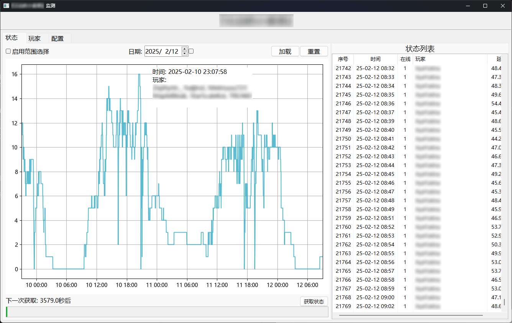
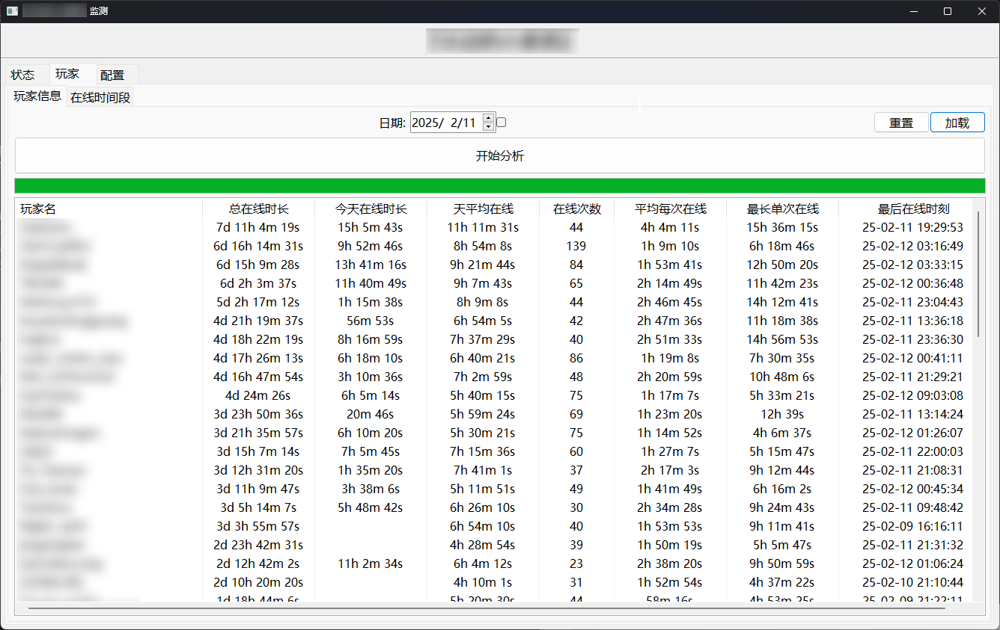
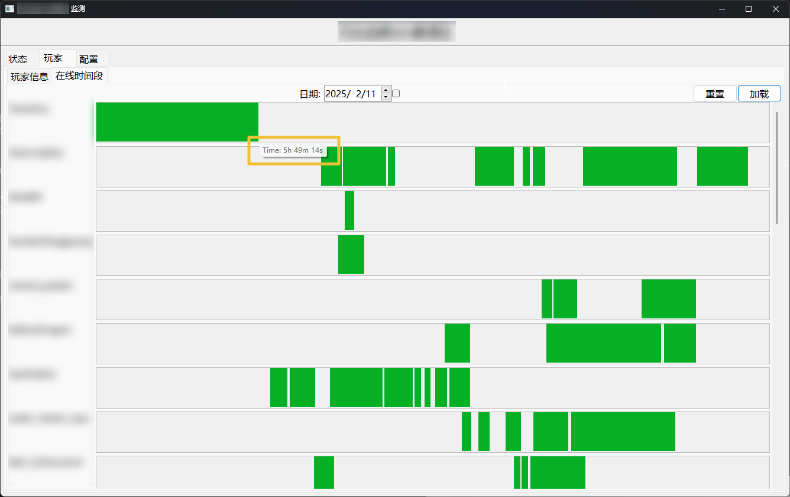
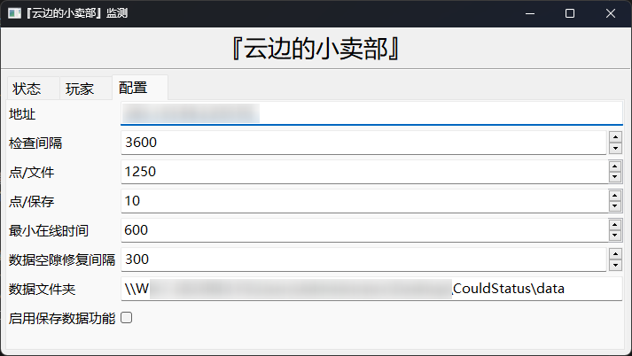

#  *CloudStatus*

> 一个服务器监测工具, 支持玩家游玩分析
> 
> ~~没啥美术细胞, 不美观~~ **以实用为主**

---

~~暂时不会为此软件提供任何许可证，软件代码仅供学习~~

好耶，我们有MPL许可证！

---

### 我们提供
1. 可选日期可滚动的 _**玩家数量图表**_
2. 可选日期的服务器玩家 _**在线分析**_
3. 小巧的数据体积, 数据量: _**213KB/day**_ (日均10玩家) (玩家映射表格式)

### 如何使用
_**版本较旧**_: 到 Release 下载打包好的zip压缩包直接运行

_**版本最新**_ (介于我不写测试, bug可能会有几只)🪳🕷️🐛:
1. `git clone https://github.com/hite4044/CloudStatus.git` 克隆项目 or 下载项目源码压缩包
2. `cd CloudStatus` 在终端中定位到项目目录
3. `pip install -r requirements.txt` 安装项目运行库
4. `python main.py` 运行项目
5. 项目运行后可在GUI界面进行配置

### 项目相关
1. Python 3.10.9
2. [项目导航图](readme_assets/project.md)

### 计划的功能
🤓☝️诶！我有一个好点子

- [ ] 数据定时备份功能
- [ ] 数据点列表 - 查找玩家功能
- [ ] 在线人数图表 - 数据去重
- [ ] 玩家在线分析窗口
  - [x] 增加在线分析时间图表
  - [ ] 增加最近在线时间段列表
- [ ] 是否记录ping延迟 配置项
- [x] 多次获取状态以获取全部玩家 支持&配置项
- [ ] 添加紧急保存数据功能

### 画廊

#### 软件主界面 

#### 玩家在线分析 

#### 玩家在线时间段分析 

#### 配置界面
